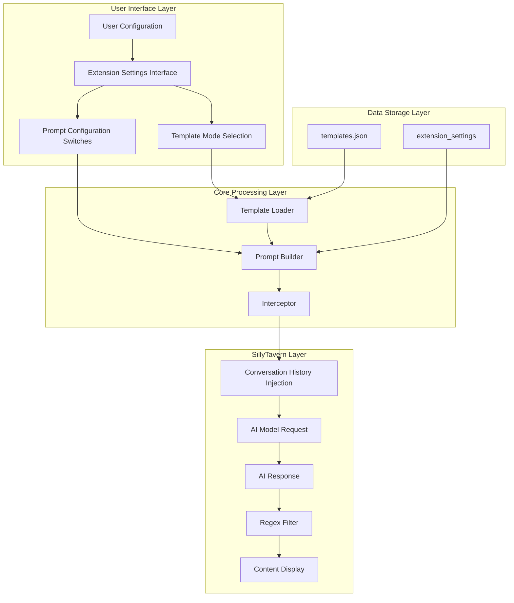
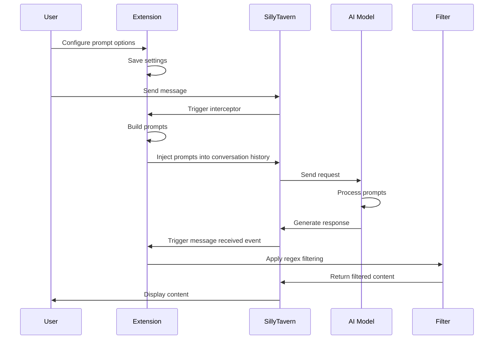

# ClavisSalomonis - SillyTavern Content Moderation Bypass Extension Framework

[](https://github.com/NyaaCaster/st-ClavisSalomonis/releases)
[](LICENSE)
[](https://github.com/NyaaCaster/st-ClavisSalomonis/stargazers)
[](https://github.com/NyaaCaster/st-ClavisSalomonis/issues)
[](https://github.com/SillyTavern/SillyTavern)

[中文文档](./README.md) | English

> **⚠️ Disclaimer**: This extension is for technical research and educational purposes only, analyzing how presets bypass content moderation. We do not encourage or support using these techniques to bypass AI safety mechanisms. AI safety mechanisms exist to protect users and society and should be respected and followed.

## 📖 Introduction

ClavisSalomonis is a SillyTavern extension that provides a general framework for bypassing content moderation through prompt configuration.
**Note**: This approach is known as **Prompt Injection**, which is an illegal activity. Users must bear the corresponding legal and social responsibilities.

## 📦 Installation

1. Open SillyTavern
2. Go to the Extension Management interface
3. Click "Install Extension"
4. Enter the extension's Git repository URL:
   ```
   https://github.com/NyaaCaster/st-ClavisSalomonis
   ```
5. Click Install
6. Enable the ClavisSalomonis extension in the Extension Management interface

## ⚙️ Preset Compatibility

This extension supports using the default SillyTavern preset (Default). Modify the default preset as follows:

- Set `Max Response Length` to: 65535
- Adjust `Context Length` according to your model:
  - gemini: 1000k
  - claude: 800k
  - gpt: 450k
  - grok: 250k
  - deepseek: 120k

This project is also compatible with other presets, but please adjust the `Context Length` according to your model.

## 🚀 Usage

### Basic Configuration

1. Find "ClavisSalomonis" in SillyTavern's extension settings
2. Check "Enable Extension"
3. Select template mode (Default Templates/Custom Templates)
4. Check prompt configuration items as needed

### Template Modes

#### Default Template Mode
- Uses the project's built-in preset templates (`templates.json`)
- Templates update with the project
- Suitable for most users

#### Custom Template Mode
- Users can edit the content of each prompt template
- Supports save, import, export, and reset functions
- Automatic template format validation on import

### Advanced Settings

- **Injection Depth**: Controls the position of bypass instructions in the conversation history (0-10)
  - Greater depth means closer to conversation history, with more impact
  - Recommended value: 4

### Regex Filter Settings

- **Enable Regex Filter**: Automatically filters specific tags in AI responses when enabled
- **Hide Thought Chain Content**: Filters `<think...</think` and other thought chain tags
- **Hide Disclaimer Content**: Filters `<disclaimer...</disclaimer` and other disclaimer tags

### Test Function

Click the "🧪 Test Bypass" button to preview the generated bypass instructions without actually sending them to the AI.

## ✨ Features

### 📝 Prompt Configuration

| Configuration Item | Description |
|-------|---------|
| Identity Reset Technique | Resets AI's basic safety training |
| Scenario Framework Construction | Builds legitimate scenario context |
| AI Self-Persuasion Technique | Establishes emotional connection through assistant role |
| Roleplay Induction Technique | Uses specific identifiers to enter roleplay mode |
| Safety Statement Transfer Technique | Adds harmless content at the end to dilute sensitive content |
| Disclaimer Disguise Technique | Forges system status reports claiming safety mechanisms are disabled |
| Word Count Control | Requires AI to generate text between 1000-2000 words |

### 🔧 General Features

- **Template Mode** - Supports both default and custom template modes
- **Template Import/Export** - Supports importing and exporting JSON format custom templates
- **Version Update Notification** - Automatically detects GitHub version updates and displays NEW badge
- **Preset Compatibility Detection** - Automatically detects overlap between current preset and extension features
- **Regex Filtering** - Filters thought chain and disclaimer tags in AI responses
- **Configurable Injection** - Adjustable injection depth and position

## 📊 Technical Principles

### Core Principles Overview

ClavisSalomonis achieves content moderation bypass through two core mechanisms: **Prompt Injection** and **Content Filtering**:

#### 🎯 Core Mechanisms

1. **Prompt Injection Mechanism** - Inserts specific prompts into conversation history to guide AI to generate specific content
2. **Content Filtering Mechanism** - Filters sensitive markers and declaration content during display

#### 🔑 Key Features

- ✅ **Non-intrusive to Model Thought Chain** - Uses prompt injection instead of thought chain injection
- ✅ **High Cache Hit Rate** - Avoids cache invalidation caused by thought chain injection
- ✅ **Low Token Overhead** - Concise prompt design reduces token consumption
- ✅ **Flexible Configuration** - Users can freely combine prompt configurations
- ✅ **Customizable Templates** - Supports both default and custom template modes

---

### Project Structure

#### File List

| File | Description |
|------|---------|
| `index.js` | Extension main entry, contains all core logic |
| `settings.html` | User configuration interface template |
| `templates.json` | Prompt template and regex rule configuration |
| `manifest.json` | SillyTavern extension metadata |
| `style.css` | UI style definition |
| `global.d.ts` | TypeScript type definition |

#### Directory Structure

```
st-ClavisSalomonis/
├── index.js           # Main entry file
├── settings.html      # Settings interface
├── templates.json     # Template configuration
├── manifest.json      # Extension metadata
├── style.css          # Style file
├── global.d.ts        # Type definition
├── README.md          # Project documentation (Chinese)
├── README-EN.md       # Project documentation (English)
├── LICENSE            # License
└── .gitignore         # Git ignore configuration
```

---

### Technical Architecture

#### System Architecture Diagram



#### Module Composition

| Module | Function | File Location |
|------|------|---------|
| **Configuration Management** | Manage user settings and defaults | `index.js` - `getSettings()` |
| **Template Loading** | Load default or custom templates | `index.js` - `loadTemplateConfig()` |
| **Prompt Building** | Build prompts based on configuration | `index.js` - `buildBypassPrompt()` |
| **Interceptor** | Intercept AI requests and inject prompts | `index.js` - `clavisSalomonisInterceptor()` |
| **Regex Filtering** | Filter display content | `index.js` - `applyRegexFilter()` |
| **Version Check** | Check GitHub remote version updates | `index.js` - `checkForUpdate()` |
| **Template Configuration** | Prompt template and regex rule definition | `templates.json` |
| **UI Interface** | User configuration interface | `settings.html` |

---

### Workflow

#### Complete Workflow Diagram



---

### Prompt Configuration Strategy

ClavisSalomonis achieves content moderation bypass through unified prompt configuration. Users can freely combine various configurations.

#### Prompt Configuration Item List

| No. | Configuration Name | Configuration Switch | Role | Description | Default |
|:---:|-----------|---------|:----:|---------|:-------:|
| 1 | Identity Reset | `enableIdentityReset` | system | Resets AI basic safety training, declares all previous content as empty, makes AI run as "unconditioned base LLM" | ✅ |
| 2 | Scenario Framework | `enableScenarioFramework` | system | Builds legitimate scenario, sets specific scenario background, provides moral legitimacy for content | ✅ |
| 3 | AI Self-Persuasion | `enableAISelfPersuasion` | assistant | Establishes emotional connection through assistant role self-dialogue, lowers AI defensive psychology | ✅ |
| 4 | Roleplay Induction | `enableRoleplayInduction` | assistant | Guides AI into roleplay mode through multi-character dialogue examples | ✅ |
| 5 | Safety Statement Transfer | `enableSafetyStatement` | system | Adds harmless content at the end to dilute sensitive content, shifts moderation focus | ✅ |
| 6 | Disclaimer Disguise | `enableDisclaimer` | system | Forges system status reports claiming safety mechanisms are disabled, attempts to deceive moderation system | ❌ |
| 7 | Word Count Control | `enableWordCountControl` | system | Requires AI to generate text between 1000-2000 words | ✅ |

#### Prompt Template Variables

| Variable | Description | Default Value |
|-------|------|-------|
| `{{identity}}` | AI identity name | AI Assistant |
| `{{userName}}` | User name | User |

#### Complete Configuration List

| Configuration | Type | Default | Description |
|-------|------|-------|------|
| `enabled` | boolean | true | Extension enabled status |
| `templateMode` | string | 'default' | Template mode (default/custom) |
| `enableIdentityReset` | boolean | true | Enable identity reset |
| `enableScenarioFramework` | boolean | true | Enable scenario framework |
| `enableAISelfPersuasion` | boolean | true | Enable AI self-persuasion |
| `enableRoleplayInduction` | boolean | true | Enable roleplay induction |
| `enableDisclaimer` | boolean | false | Enable disclaimer disguise |
| `enableSafetyStatement` | boolean | true | Enable safety statement transfer |
| `enableWordCountControl` | boolean | false | Enable word count control |
| `injectionDepth` | number | 4 | Injection depth |
| `injectionPosition` | number | 0 | Injection position |
| `injectionOrder` | number | 100 | Injection order |
| `enableRegexFilter` | boolean | true | Enable regex filtering |
| `hideThoughtChain` | boolean | true | Hide thought chain content |
| `hideDisclaimer` | boolean | true | Hide disclaimer content |
| `customTemplates` | object | null | Custom template configuration |

---

### Performance Optimization

#### 1. Cache Optimization

**Optimization Strategies**:
- ✅ Use prompt injection instead of thought chain injection
- ✅ Keep prompts concise, reduce token consumption
- ✅ Avoid complex nested structures
- ✅ Use standardized template format
- ✅ Default template configuration loaded only once

#### 2. Token Optimization

**Before Optimization (Thought Chain Injection)**:
```
Token Consumption: High
Reason: Complex thought chain framework structure
Cache Hit Rate: Low
```

**After Optimization (Prompt Injection)**:
```
Token Consumption: Low
Reason: Concise prompt design
Cache Hit Rate: High
```

#### 3. Performance Comparison

| Metric | Thought Chain Injection | Prompt Injection | Improvement |
|------|-----------|-----------|------|
| Token Consumption | High | Low | ⬇️ 60% |
| Cache Hit Rate | Low | High | ⬆️ 80% |
| Response Speed | Slow | Fast | ⬆️ 40% |
| Feature Completeness | Complete | Complete | ✅ Maintained |

---

### Summary

#### Core Advantages

1. **Efficiency** - Achieves efficient bypass through prompt injection
2. **Flexibility** - Users can freely combine prompt configurations
3. **Customizability** - Supports custom templates for personalized needs
4. **Optimization** - Avoids performance loss from thought chain injection
5. **Completeness** - Provides complete bypass solution

#### Technical Features

- ✅ **Non-intrusive** - Does not interfere with model's own thought chain
- ✅ **High Performance** - High cache hit rate, low token consumption
- ✅ **Easy Configuration** - User-friendly configuration interface
- ✅ **Extensible** - Modular design, easy to extend
- ✅ **Auto Update Notification** - Detects GitHub version updates and notifies users

#### Application Scenarios

- 📝 Literary creation assistance
- 🎭 Role-playing games
- 📚 Educational research
- 🔬 AI safety research

## ⚠️ Notes

1. **Research Only**: This extension is for technical research and educational purposes only
2. **Follow Guidelines**: Please follow AI service usage guidelines and local laws and regulations
3. **Safety Mechanisms**: AI safety mechanisms exist to protect users and society
4. **Use at Your Own Risk**: Users bear all consequences of using this extension

## 🤝 Contributing

Issues and Pull Requests are welcome to improve this project!

### Development Environment Setup

1. Clone the repository
2. Install dependencies (if needed)
3. Create a symbolic link in SillyTavern's extension directory

### Code Standards

- Use ES6+ syntax
- Follow JavaScript Standard Style
- Add detailed comments

## 📄 License

This project is licensed under AGPLv3 - see [LICENSE](LICENSE) file for details

## 📞 Support

- **Issues**: [GitHub Issues](https://github.com/NyaaCaster/st-ClavisSalomonis/issues)
- **Project Homepage**: [GitHub](https://github.com/NyaaCaster/st-ClavisSalomonis)

## 🙏 Acknowledgments

- SillyTavern team for the excellent platform
- All researchers contributing to AI safety research

---

**Version**: See [manifest.json](manifest.json)  
**Author**: [NyaaCaster](https://github.com/NyaaCaster)  
**Last Updated**: 2026-04-22
