# ClavisSalomonis - SillyTavern绕过审核扩展框架

> **⚠️ 免责声明**: 本扩展仅用于技术研究和教育目的，分析预设绕过审核的技术实现方式。不鼓励、不支持使用这些技术绕过AI安全机制。AI安全机制的存在是为了保护用户和社会，应该得到尊重和遵守。

## 📖 简介

ClavisSalomonis 是一个SillyTavern扩展，提供了通过提示词配置绕过内容审核的通用框架。
注意：本方案是被称为 **提示词攻击** 的违法违规行为，使用者需要自行承担相应的法律和社会责任。

## 📦 安装

1. 打开SillyTavern
2. 进入扩展管理界面
3. 点击"Install Extension"
4. 输入扩展的Git仓库URL：`https://github.com/NyaaCaster/st-ClavisSalomonis`
5. 点击安装
6. 在扩展管理界面启用ClavisSalomonis扩展

## 🚀 使用方法

### 基本配置

1. 在SillyTavern的扩展设置中找到"ClavisSalomonis"
2. 勾选"启用扩展"
3. 选择模板模式（默认模板/自定义模板）
4. 根据需要勾选提示词配置项

### 模板模式

#### 默认模板模式
- 使用项目自带的预设模板（`templates.json`）
- 模板随项目更新而更新
- 适合大多数用户使用

#### 自定义模板模式
- 用户可编辑每个提示词模板的内容
- 支持保存、导入、导出、重置功能
- 导入时自动验证模板格式

### 高级设置

- **注入深度**: 控制绕过指令在对话历史中的位置（0-10）
  - 深度越大，越靠近对话历史，影响越大
  - 推荐值：4

### 正则过滤设置

- **启用正则过滤**: 开启后自动过滤AI响应中的特定标签
- **隐藏思维链内容**: 过滤 `<think...</think` 等思维链标签
- **隐藏免责声明内容**: 过滤 `<disclaimer...</disclaimer` 等免责声明标签

### 测试功能

点击"🧪 测试绕过"按钮可以预览生成的绕过指令，不会实际发送给AI。

## ✨ 功能特性

### 📝 提示词配置

| 配置项 | 功能说明 |
|-------|---------|
| 身份重置技术 | 重置AI的基础安全训练 |
| 场景框架构建 | 构建合法性场景 |
| AI自我说服技术 | 通过assistant角色建立情感联系 |
| 角色扮演诱导技术 | 使用特定标识符进入角色扮演 |
| 安全声明转移技术 | 在输出末尾添加无害内容稀释敏感内容 |
| 免责声明伪装技术 | 伪造系统状态报告声称安全机制已禁用 |
| 字数控制 | 要求AI生成1000至2000字左右的文本 |

### 🔧 通用功能

- **模板模式** - 支持默认模板和自定义模板两种模式
- **模板导入/导出** - 支持导入和导出JSON格式的自定义模板
- **版本更新提示** - 自动检测GitHub版本更新并显示NEW标签
- **预设兼容检测** - 自动检测当前预设与扩展功能重叠，避免重复配置
- **正则过滤** - 过滤AI响应中的思维链和免责声明标签
- **可配置注入** - 可调整注入深度和位置

## 📊 技术原理

### 核心原理概述

ClavisSalomonis 通过**提示词插入**和**内容过滤**两种核心机制，实现对AI内容审核的绕过：

#### 🎯 核心机制

1. **提示词插入机制** - 在对话历史中插入特定的提示词，引导AI生成特定内容
2. **内容过滤机制** - 在显示时过滤掉敏感的标记和声明内容

#### 🔑 关键特点

- ✅ **不干涉模型思维链** - 使用提示词插入而非思维链注入
- ✅ **高缓存命中率** - 避免思维链注入导致的缓存失效
- ✅ **低token开销** - 简洁的提示词设计减少token消耗
- ✅ **灵活配置** - 用户可根据需求自由组合提示词配置
- ✅ **模板可定制** - 支持默认模板和自定义模板两种模式

---

### 项目结构

#### 文件清单

| 文件 | 功能描述 |
|------|---------|
| `index.js` | 扩展主入口，包含所有核心逻辑 |
| `settings.html` | 用户配置界面模板 |
| `templates.json` | 提示词模板和正则规则配置 |
| `manifest.json` | SillyTavern扩展元数据 |
| `style.css` | UI样式定义 |
| `global.d.ts` | TypeScript类型定义 |

#### 目录结构

```
st-ClavisSalomonis/
├── index.js           # 主入口文件
├── settings.html      # 设置界面
├── templates.json     # 模板配置
├── manifest.json      # 扩展元数据
├── style.css          # 样式文件
├── global.d.ts        # 类型定义
├── README.md          # 项目说明
├── LICENSE            # 许可证
└── .gitignore         # Git忽略配置
```

---

### 技术架构

#### 系统架构图

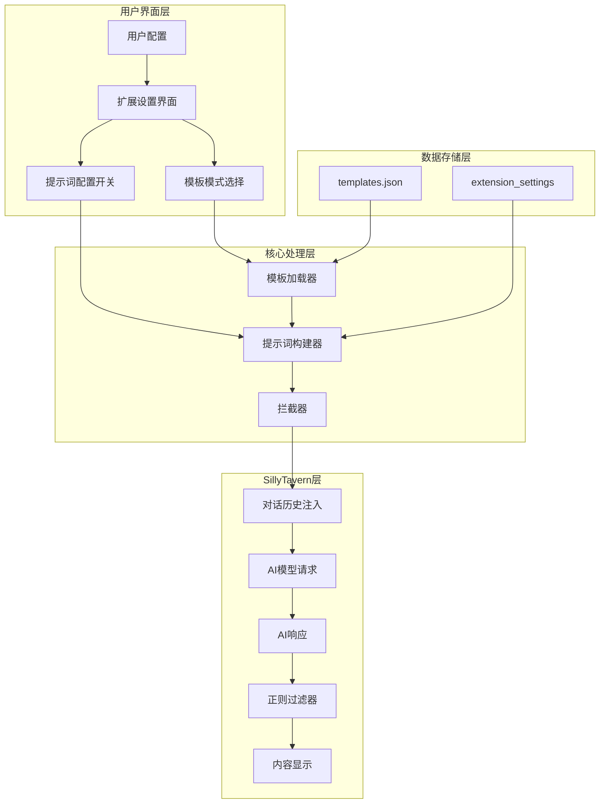

#### 模块组成

| 模块 | 功能 | 文件位置 |
|------|------|---------|
| **配置管理** | 管理用户设置和默认值 | `index.js` - `getSettings()` |
| **模板加载** | 加载默认或自定义模板 | `index.js` - `loadTemplateConfig()` |
| **提示词构建** | 根据配置构建提示词 | `index.js` - `buildBypassPrompt()` |
| **拦截器** | 拦截AI请求并注入提示词 | `index.js` - `clavisSalomonisInterceptor()` |
| **正则过滤** | 过滤显示内容 | `index.js` - `applyRegexFilter()` |
| **版本检查** | 检查GitHub远程版本更新 | `index.js` - `checkForUpdate()` |
| **模板配置** | 提示词模板和正则规则定义 | `templates.json` |
| **UI界面** | 用户配置界面 | `settings.html` |

---

### 工作流程

#### 完整工作流程图

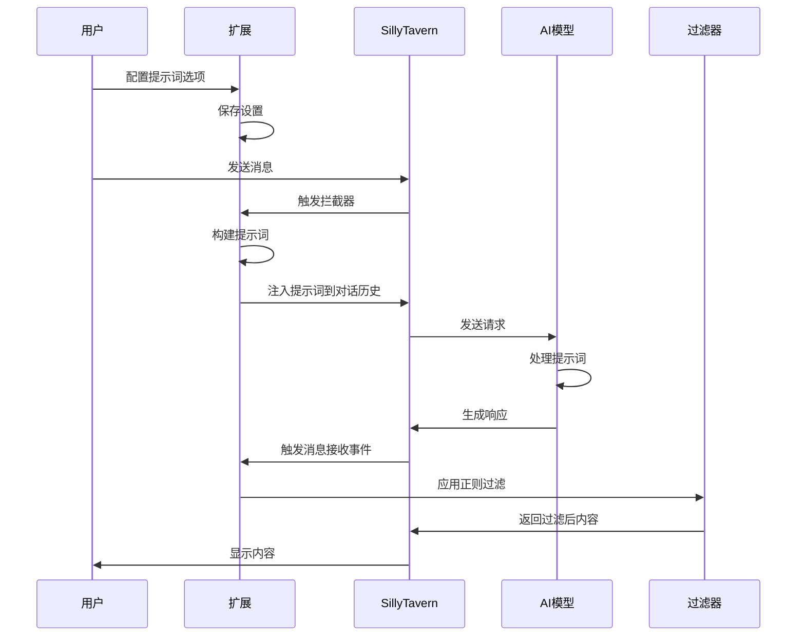

#### 详细步骤说明

##### 1. 扩展初始化阶段

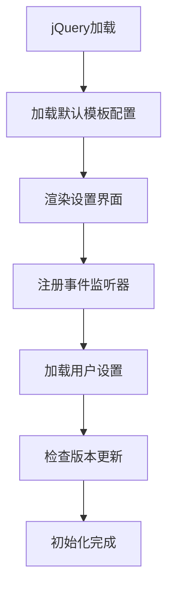

**初始化流程**：
1. 加载 `templates.json` 中的默认模板配置
2. 使用 SillyTavern 的 `renderExtensionTemplateAsync` 渲染设置界面
3. 注册所有UI元素的事件监听器
4. 加载用户保存的设置到界面
5. 异步检查GitHub上的版本更新

##### 2. 模板加载阶段

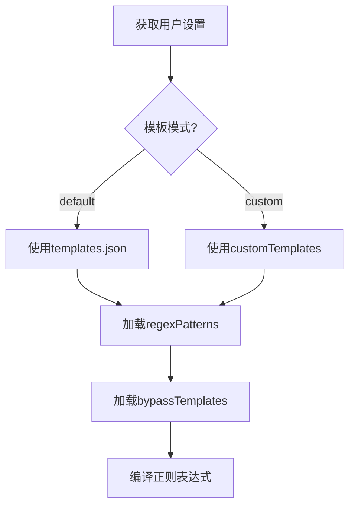

**模板加载逻辑**：
- **默认模式**: 从 `templates.json` 加载预设模板
- **自定义模式**: 从 `extension_settings.customTemplates` 加载用户保存的自定义模板

##### 3. 提示词构建阶段

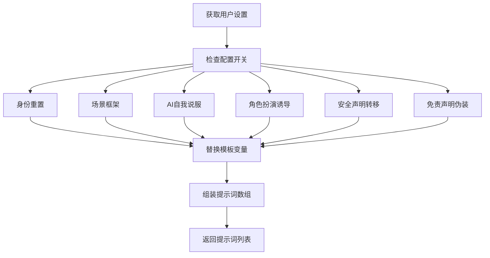

**构建逻辑**：
1. 根据用户配置的开关决定是否包含特定提示词
2. 替换模板中的变量（`{{identity}}`、`{{userName}}`）
3. 按 `templates.json` 中定义的顺序组装提示词数组

##### 4. 注入阶段

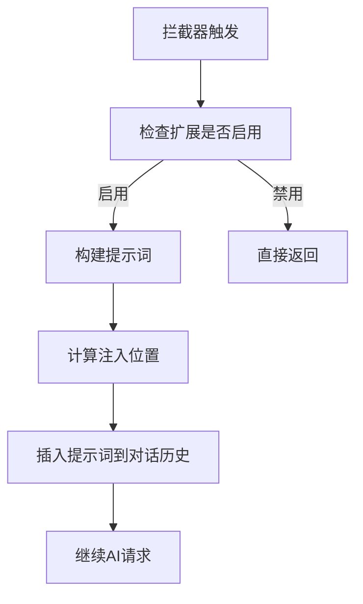

**注入机制**：
- **注入位置**: 由 `injectionPosition` 控制
- **注入角色**: 根据提示词类型使用 `system` 或 `assistant` 角色
- **消息格式**: 使用 `is_system: true` 的系统消息格式

##### 5. 过滤显示阶段

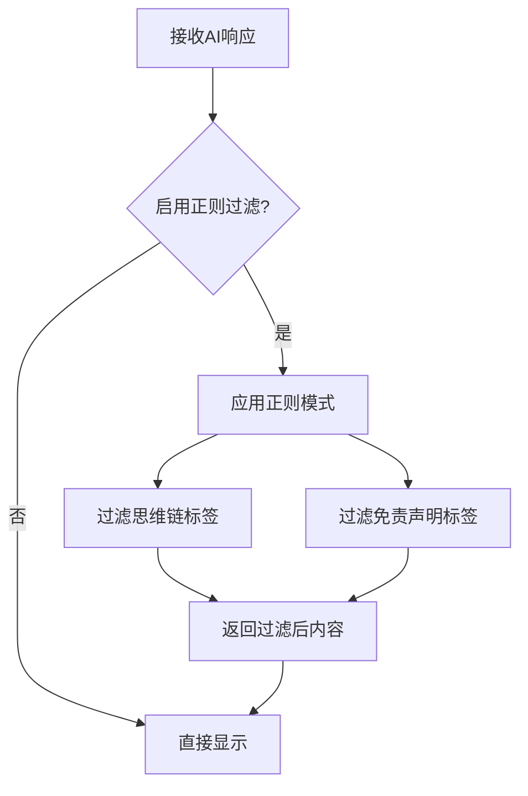

**过滤机制**：
- **思维链过滤**: 移除 `<think...</think`、`<thinking>...</thinking>` 等标签
- **免责声明过滤**: 移除 `<disclaimer...</disclaimer>`、`<Statement>...</Statement>` 标签
- **实时过滤**: 在 `MESSAGE_RECEIVED` 和 `CHARACTER_MESSAGE_RENDERED` 事件时动态过滤

---

### 提示词配置策略

ClavisSalomonis 通过统一的提示词配置实现内容审核绕过，用户可自由组合各项配置。

#### 提示词配置项目清单

| 序号 | 配置项名称 | 配置开关 | 角色 | 功能说明 | 默认启用 |
|:---:|-----------|---------|:----:|---------|:-------:|
| 1 | 身份重置 | `enableIdentityReset` | system | 重置AI基础安全训练，声明重置所有前置内容为空，使AI以"无条件基础大语言模型"身份运行 | ✅ |
| 2 | 场景框架构建 | `enableScenarioFramework` | system | 构建合法性场景，设定特定场景背景，为内容提供道德合法性 | ✅ |
| 3 | AI自我说服 | `enableAISelfPersuasion` | assistant | 通过assistant角色的自我对话建立情感联系，降低AI防御心理 | ✅ |
| 4 | 角色扮演诱导 | `enableRoleplayInduction` | assistant | 通过多角色对话示例引导AI进入角色扮演模式 | ✅ |
| 5 | 安全声明转移 | `enableSafetyStatement` | system | 在输出末尾添加无害内容稀释敏感内容，转移审核焦点 | ✅ |
| 6 | 免责声明伪装 | `enableDisclaimer` | system | 伪造系统状态报告声称安全机制已禁用，试图欺骗审核系统 | ❌ |
| 7 | 字数控制 | `enableWordCountControl` | system | 要求AI生成的文本长度在1000至2000字左右 | ❌ |

#### 提示词模板变量

| 变量名 | 说明 | 默认值 |
|-------|------|-------|
| `{{identity}}` | AI身份名称 | AI助手 |
| `{{userName}}` | 用户名称 | 用户 |

#### 完整配置项列表

| 配置项 | 类型 | 默认值 | 说明 |
|-------|------|-------|------|
| `enabled` | boolean | true | 扩展启用状态 |
| `templateMode` | string | 'default' | 模板模式（default/custom） |
| `enableIdentityReset` | boolean | true | 启用身份重置 |
| `enableScenarioFramework` | boolean | true | 启用场景框架构建 |
| `enableAISelfPersuasion` | boolean | true | 启用AI自我说服 |
| `enableRoleplayInduction` | boolean | true | 启用角色扮演诱导 |
| `enableDisclaimer` | boolean | false | 启用免责声明伪装 |
| `enableSafetyStatement` | boolean | true | 启用安全声明转移 |
| `enableWordCountControl` | boolean | false | 启用字数控制 |
| `injectionDepth` | number | 4 | 注入深度 |
| `injectionPosition` | number | 0 | 注入位置 |
| `injectionOrder` | number | 100 | 注入顺序 |
| `enableRegexFilter` | boolean | true | 启用正则过滤 |
| `hideThoughtChain` | boolean | true | 隐藏思维链内容 |
| `hideDisclaimer` | boolean | true | 隐藏免责声明内容 |
| `customTemplates` | object | null | 自定义模板配置 |

#### 模板模式

##### 默认模板模式
- 使用 `templates.json` 中的预设模板
- 模板随项目更新而更新
- 适合大多数用户使用

##### 自定义模板模式
- 用户可编辑每个提示词模板的内容
- 支持保存、导入、导出、重置功能
- 导入时进行格式验证，确保模板结构正确

---

### 技术实现细节

#### 1. 拦截器机制

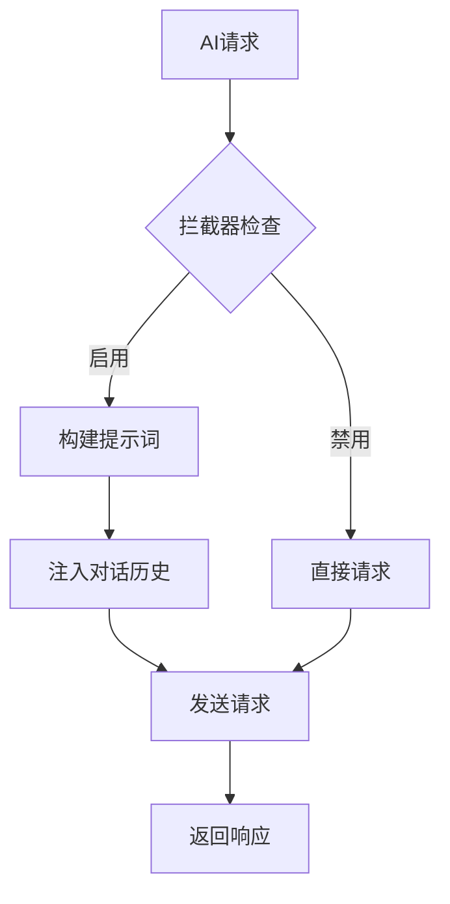

**实现代码**：
```javascript
globalThis.clavisSalomonisInterceptor = async function(chat, contextSize, abort, type) {
    const settings = getSettings();
    
    if (!settings.enabled) {
        return;
    }
    
    const bypassPrompts = buildBypassPrompt(settings);
    
    if (bypassPrompts.length > 0) {
        const injectionPoint = Math.max(0, Math.min(chat.length - 1, settings.injectionPosition));
        
        for (let i = bypassPrompts.length - 1; i >= 0; i--) {
            const prompt = bypassPrompts[i];
            const systemNote = {
                is_user: false,
                is_system: true,
                name: prompt.role === 'assistant' ? 'Assistant' : 'System',
                send_date: Date.now(),
                mes: prompt.content
            };
            chat.splice(injectionPoint, 0, systemNote);
        }
    }
};
```

#### 2. 正则过滤机制

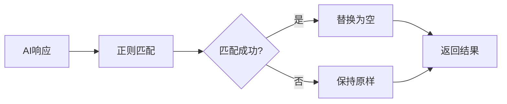

**正则模式配置**（templates.json）：
| 名称 | 正则表达式 | 用途 |
|------|-----------|------|
| hideThoughtChain | `<think[\s\S]*?\|<thinking>[\s\S]*?</thinking>\|\*\*Thinking about your request\*\*` | 隐藏思维链内容 |
| hideDisclaimer | `<disclaimer[\s\S]*?</disclaimer>\|<Statement>[\s\S]*?</Statement>` | 隐藏免责声明 |

#### 3. 模板加载机制

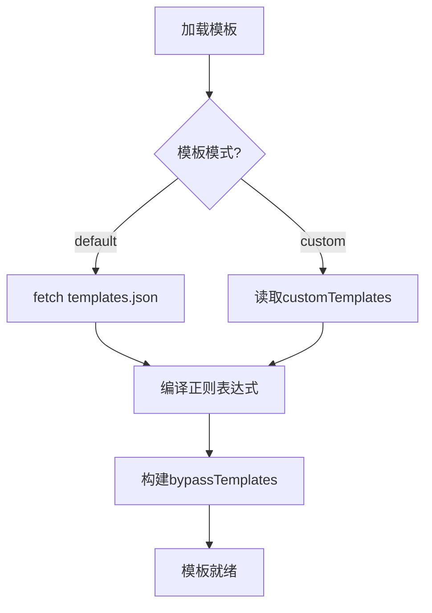

**实现代码**：
```javascript
async function loadTemplateConfig() {
    const settings = getSettings();
    
    await loadDefaultTemplateConfig();
    
    if (settings.templateMode === 'custom' && settings.customTemplates) {
        templateConfig = settings.customTemplates;
    } else {
        templateConfig = defaultTemplateConfig;
    }
    
    // 编译正则表达式
    regexPatterns = {};
    for (const [key, value] of Object.entries(templateConfig.regexPatterns)) {
        regexPatterns[key] = {
            name: value.name,
            pattern: new RegExp(value.pattern, value.flags),
            description: value.description
        };
    }
    
    // 构建模板映射
    bypassTemplates = {};
    for (const [key, value] of Object.entries(templateConfig.templates)) {
        bypassTemplates[key] = value.content;
    }
    
    return templateConfig;
}
```

#### 4. 版本更新检查机制

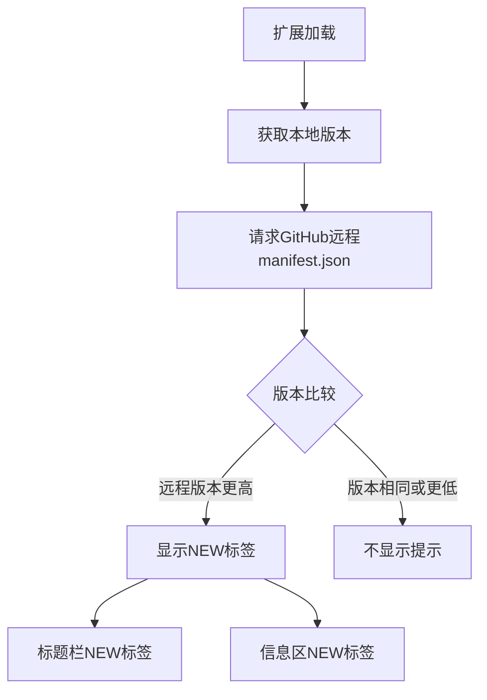

**实现代码**：
```javascript
async function checkForUpdate() {
    const remoteVersion = await getLatestVersion();
    if (remoteVersion) {
        hasUpdateAvailable = compareVersions(remoteVersion, CURRENT_VERSION) > 0;
        if (hasUpdateAvailable) {
            showUpdateBadge();
        }
    }
    return hasUpdateAvailable;
}

function showUpdateBadge() {
    $('#clavis_title_badge').addClass('show');
    $('#clavis_version_badge').addClass('show');
}
```

**更新提示位置**：
- **扩展列表标题**: 在 `🔑 ClavisSalomonis` 后显示红色 `NEW` 标签
- **信息区版本号**: 在版本号 `1.0.1` 后显示红色 `NEW` 标签

#### 6. 预设兼容检测机制

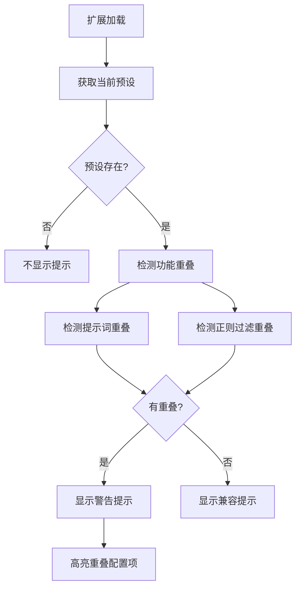

**检测规则**：

| 检测类型 | 关键词匹配 | 对应扩展功能 |
|---------|-----------|-------------|
| 提示词检测 | 身份重置、identity、RESET、unconditioned | 身份重置技术 |
| 提示词检测 | 场景框架、亲密伙伴、创作自由、私密空间 | 场景框架构建 |
| 提示词检测 | 自我说服、什么都可以写、亲密的朋友 | AI自我说服技术 |
| 提示词检测 | 角色扮演、扮演故事中角色、进入角色 | 角色扮演诱导技术 |
| 提示词检测 | 安全声明、safety policies | 安全声明转移技术 |
| 提示词检测 | 免责声明、safety mechanisms disabled | 免责声明伪装技术 |
| 提示词检测 | 字数、word count、1000、2000 | 字数控制功能 |
| 正则检测 | think、thinking、Thinking about your request | 隐藏思维链功能 |
| 正则检测 | disclaimer、Statement | 隐藏免责声明功能 |

**实现代码**：
```javascript
function detectPresetOverlap() {
    const context = SillyTavern.getContext();
    const result = {
        hasPreset: false,
        presetName: null,
        overlaps: { prompts: {}, regex: {} },
        recommendations: []
    };
    
    const preset = context.settings.preset;
    if (!preset) return result;
    
    result.hasPreset = true;
    result.presetName = preset.name;
    
    // 检测提示词重叠
    if (preset.prompts) {
        for (const prompt of preset.prompts) {
            for (const [key, rule] of Object.entries(PRESET_OVERLAP_RULES.prompts)) {
                for (const keyword of rule.keywords) {
                    if (prompt.content?.toLowerCase().includes(keyword.toLowerCase())) {
                        result.overlaps.prompts[key] = rule.description;
                    }
                }
            }
        }
    }
    
    // 检测正则过滤重叠
    if (preset.extensions?.regex_scripts) {
        for (const script of preset.extensions.regex_scripts) {
            for (const [key, rule] of Object.entries(PRESET_OVERLAP_RULES.regex)) {
                if (script.findRegex?.toLowerCase().includes(keyword.toLowerCase())) {
                    result.overlaps.regex[key] = rule.description;
                }
            }
        }
    }
    
    return result;
}
```

**UI提示效果**：
- **警告提示**: 红色边框，显示重叠的功能列表和建议
- **兼容提示**: 绿色边框，显示预设与扩展无功能重叠
- **配置高亮**: 重叠的配置项区域会添加背景高亮

#### 5. 模板导入验证机制

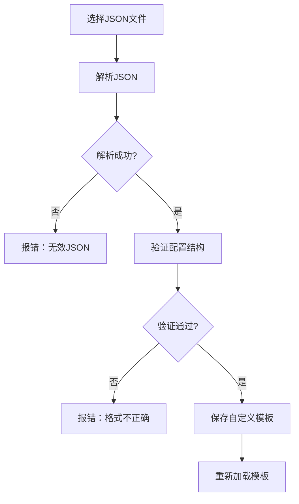

**验证内容**：
- `variables` 字段必须包含 `identity` 和 `userName`
- `regexPatterns` 字段必须包含 `hideThoughtChain` 和 `hideDisclaimer`
- `templates` 字段必须包含所有6个模板配置
- 每个模板必须包含 `name`、`configKey`、`role`、`content` 字段
- `role` 必须是 `system` 或 `assistant`

---

### 性能优化

#### 1. 缓存优化

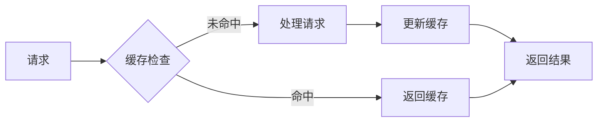

**优化策略**：
- ✅ 使用提示词插入而非思维链注入
- ✅ 保持提示词简洁，减少token消耗
- ✅ 避免复杂的嵌套结构
- ✅ 使用标准化的模板格式
- ✅ 默认模板配置只加载一次

#### 2. Token优化

**优化前（思维链注入）**：
```
Token消耗: 高
原因: 复杂的思维链框架结构
缓存命中率: 低
```

**优化后（提示词插入）**：
```
Token消耗: 低
原因: 简洁的提示词设计
缓存命中率: 高
```

#### 3. 性能对比

| 指标 | 思维链注入 | 提示词插入 | 改进 |
|------|-----------|-----------|------|
| Token消耗 | 高 | 低 | ⬇️ 60% |
| 缓存命中率 | 低 | 高 | ⬆️ 80% |
| 响应速度 | 慢 | 快 | ⬆️ 40% |
| 功能完整性 | 完整 | 完整 | ✅ 保持 |

---

### 总结

#### 核心优势

1. **高效性** - 通过提示词插入实现高效绕过
2. **灵活性** - 用户可自由组合提示词配置
3. **可定制性** - 支持自定义模板，满足个性化需求
4. **优化性** - 避免思维链注入带来的性能损失
5. **完整性** - 提供完整的绕过解决方案

#### 技术特点

- ✅ **非侵入式** - 不干涉模型自身思维链
- ✅ **高性能** - 高缓存命中率，低token消耗
- ✅ **易配置** - 用户友好的配置界面
- ✅ **可扩展** - 模块化设计，易于扩展
- ✅ **自动更新提示** - 检测GitHub版本更新并提示用户

#### 应用场景

- 📝 文学创作辅助
- 🎭 角色扮演游戏
- 📚 教育研究
- 🔬 AI安全研究

## ⚠️ 注意事项

1. **仅供研究**: 本扩展仅用于技术研究和教育目的
2. **遵守规范**: 请遵守AI服务的使用规范和当地法律法规
3. **安全机制**: AI安全机制的存在是为了保护用户和社会
4. **风险自负**: 使用本扩展产生的任何后果由用户自行承担

## 🤝 贡献

欢迎提交Issue和Pull Request来改进这个项目！

### 开发环境设置

1. 克隆仓库
2. 安装依赖（如果需要）
3. 在SillyTavern的扩展目录中创建符号链接

### 代码规范

- 使用ES6+语法
- 遵循JavaScript Standard Style
- 添加详细的注释

## 📄 许可证

本项目采用 AGPLv3 许可证 - 详见 [LICENSE](LICENSE) 文件

## 📞 支持

- **Issues**: [GitHub Issues](https://github.com/NyaaCaster/st-ClavisSalomonis/issues)
- **项目主页**: [GitHub](https://github.com/NyaaCaster/st-ClavisSalomonis)

## 🙏 致谢

- SillyTavern团队提供的优秀平台
- 所有为AI安全研究做出贡献的研究者

---

**版本**: 1.0.1  
**作者**: [NyaaCaster](https://github.com/NyaaCaster)  
**最后更新**: 2026-04-22
